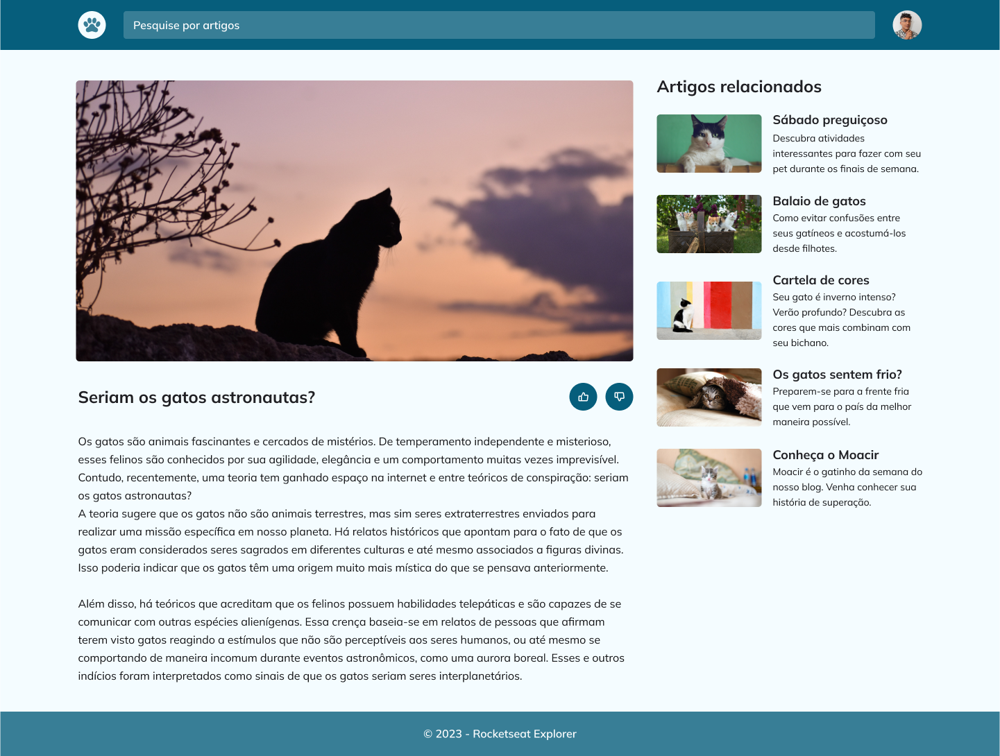

<h1 align="center"> Desafio - Blog de Gatos</h1>

  <a href="#-tecnologias">Tecnologias</a>&nbsp;&nbsp;&nbsp;|&nbsp;&nbsp;&nbsp;
  <a href="#-projeto">Desafio</a>&nbsp;&nbsp;&nbsp;|&nbsp;&nbsp;&nbsp;
  <a href="#-layout">Layout</a>

 

## 🚀 Tecnologias

Esse projeto foi desenvolvido com as seguintes tecnologias:

- HTML e CSS
- Git e Github
- Figma

## 💻 Sobre o desafio

Nesse desafio, você deverá recriar uma aplicação, a partir de um layout pronto no Figma utilizando:

- Mobile First: inicie o projeto deixando-o responsivo em telas menores para depois ajustar para uma versão desktop;
- Unidade de medida flexível;
- Grid;
- Variáveis no CSS;
- Cores HSL;
- Animações e transições simples.
- [Acesse o projeto finalizado, online](https://renanbonani.github.io/Desafio-RecriandoLayout02)

## 🔖 Layout

  
  

